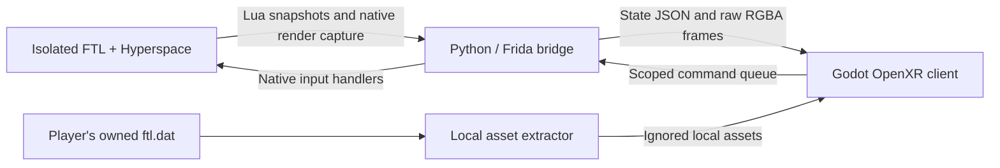

# Architecture

[Back to README](../README.md) · [Development](DEVELOPMENT.md) · [Project status](STATUS.md)

FTL Tabletop VR is a companion renderer and input bridge for the **real single-player FTL process**. It does not reimplement the campaign, combat simulation or save format. FTL remains responsible for damage, cooldowns, crew pathfinding, events, progression, audio and saves.

## Data and input flow

The normal launcher coordinates both programs. Commands call the verified game process's input handlers rather than generating global desktop mouse or keyboard events.

## Main components

| Location | Responsibility |
|---|---|
| [project.godot](../project.godot), [main.tscn](../main.tscn) | Godot entry point, renderer and OpenXR configuration |
| [scripts/main.gd](../scripts/main.gd) | Scene lifecycle, placement, state application, controller input and context-sensitive interaction |
| [openxr_action_map.tres](../openxr_action_map.tres) | Steam Frame and fallback controller action profiles |
| [bridge/ftlvr_bridge.lua](../bridge/ftlvr_bridge.lua) | Hyperspace snapshots of native ships, rooms, crew, systems, doors, drones, hazards and combat events |
| [bridge/agent.js](../bridge/agent.js) | Frida native hooks, capture and queued process-scoped input |
| [tools/run_bridge.py](../tools/run_bridge.py) | Process bridge, snapshot normalization, input translation, asset lookup and frame publication |
| [tools/launch.py](../tools/launch.py) | Preflight, VR-save backup, game/client launch, freshness checks and graceful shutdown |
| [tools/prepare_lab.py](../tools/prepare_lab.py), [tools/resolve_hooks.py](../tools/resolve_hooks.py) | Isolated game preparation and exact supported executable hook resolution |
| [tools/extract_ftl.py](../tools/extract_ftl.py) | Owner-local layouts, hull images, UI icons/artwork and bitmap fonts |
| [scripts/ship_model.gd](../scripts/ship_model.gd), `voxel_*.gd` | Volumetric hull presentation, doors, crew, weapons and drones |
| [scripts/combat_effects.gd](../scripts/combat_effects.gd), [scripts/space_environment.gd](../scripts/space_environment.gd) | Native-driven shot presentation and surrounding space/hazards |
| `scripts/hud_*.gd`, `controller_*.gd`, `ftl_ui_*.gd` | Original captured HUD, themed hand screens, Help infographic and local font decoding |
| [scripts/shortcut_wheel.gd](../scripts/shortcut_wheel.gd), [scripts/rename_keyboard.gd](../scripts/rename_keyboard.gd) | Contextual shortcuts and native rename field interaction |

## Authoritative state

The Lua snapshot protocol identifies its source as Hyperspace and includes ships, rooms, crew, doors, weapons, drones, system power/status, current UI context, dialog choices and combat events. The Python layer normalizes optional collections and crew membership, then publishes fresh state atomically.

Godot uses this state to place and animate visual actors. Native positions, current ship/space, ownership, deployment, cooldowns and sensor visibility matter independently. For example, an enemy-owned combat drone attacking the player renders around the player ship. Boarding crew render on the ship they currently occupy.

Projectiles originate from native weapon/drone locations and follow native shot information. Rendering does not determine hits or damage. Pause freezes presentation clocks while keeping actual native paused projectiles visible and removing stale shots. Environmental animation conveys the current hazard; exact hazard timing remains a polish/verification area.

## Original HUD and floating windows

The game renders its original HUD into a separate native framebuffer. This retains native fonts, localization, power widgets, tooltips and values even when the normal backbuffer displays Tactical, the map or a window. The bridge removes unwanted world/enemy HUD pixels for the headset layer and preserves complete native window content for floating panels.

Transport uses atomic raw RGBA files with an `FVR1` header, dimensions, sequence and timestamp. Tactical is captured at a target **30 Hz / 960×540**; map/windows retain **1280×720**. The independent HUD targets **10 Hz / 1280×720**. Native input coordinates remain **1280×720** regardless of capture resolution. PNG previews update at about 1 Hz and are diagnostics rather than the live transport.

The client reuses textures, reads only fresh frames and renders UI subviewports on changes. HUD/panel crops and alpha-aware pointing preserve native control coordinates. The hand panel receives priority over the headset HUD where they overlap. Rooms use floor intersections for targeting and crew drops, avoiding doors or miniatures blocking the intended destination.

## Local assets and generated data

`local_game_data/` is intentionally absent from this source package and ignored by Git. Each player extracts required content from their owned `ftl.dat`. The bridge can produce layout/image variants for encountered ships from that same local archive. The original soundtrack plays through FTL itself.

Hull artwork, system icons, fonts and captured game pixels are owner-local. Crew, weapon and drone geometry is created by the project's procedural model code. Shared immutable meshes/materials, cached icons/shields and batched room-hazard transforms reduce scene overhead.

During a live session local files include state, frame streams, the command queue, bridge status, tracking diagnostics and logs. These are transient operational files; do not commit them or include a live local-data folder in a source release.

## Isolation and version gates

The verified route prepares a separate copy of Steam Windows FTL 1.6.14, applies the official rollback to 1.6.9, and activates Hyperspace there. Native hooks are resolved for that exact supported executable. Unknown or changed executable fingerprints are rejected; removing these checks is not a compatibility fix.

The lab uses a separate `hs_ftlvr_` save prefix, and the launcher backs up that VR profile and lab settings before running. Game input is scoped to the verified process; text operations include an active-field identity so stale keyboard commands are rejected. Closing the client requests FTL's normal save-and-exit route.

## Demo versus live play

`--demo` avoids a live campaign connection and enables mocked renderer actions. Full ship/UI visuals still require owner-local extracted assets. Running the Godot project alone does not launch FTL and cannot provide an actual campaign. Use the combined launcher for live desktop or VR play after completing [installation](INSTALLATION.md).

Rendered fixtures, tests and desktop profiling establish specific renderer behavior. They do not establish Steam Frame comfort, complete campaign support or stereo headset frame pacing.
